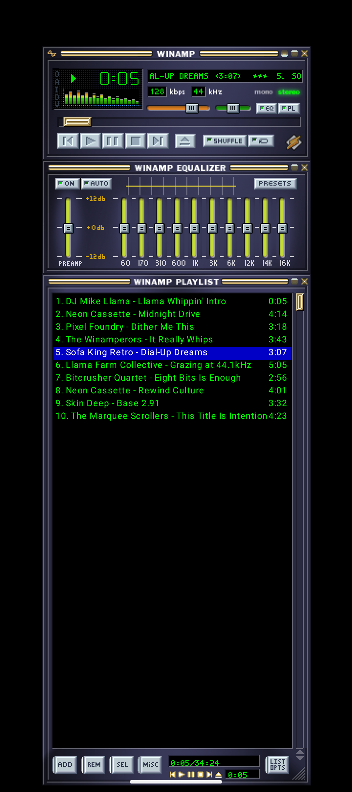

# Andamp

Winamp 2.8 on your Android phone. Pixel for pixel.

Andamp renders the classic Winamp interface (player, equalizer and playlist) from real
Winamp skin files: the actual sprite sheets from `.wsz` skins, drawn at integer scale with
nearest-neighbor filtering.

<p align="center">
  
</p>

## Status

Andamp is in internal testing on Google Play. [CHANGELOG.md](CHANGELOG.md) lists what each
release changed.

What works:

- Local files, folders and the phone's music library, plus internet radio streams, through
  a Media3/ExoPlayer backend that keeps playing in the background with a media notification.
- The whole interface: transport, seekbar, volume and balance, the marquee, a working 10-band
  equalizer with the factory presets, playlist editing, shade mode, and the built-in
  spectrum analyzer and oscilloscope.
- A translucent window (Android 9+), so the windows float over your wallpaper, or Double
  Size (the D in the clutter bar) to fill the screen with the player instead.
- DSP effects in Preferences, extendable with `.lua` plug-ins.
- A visualizer window running AVS and Milkdrop presets.
- A floating player that stays on top of other apps (Android 11+), and a home-screen widget.
- A browser for the Winamp Skin Museum.
- Jellyfin, Plex and Subsonic servers, through music sources that install as separate apps
  beside the player. See [docs/source-packs.md](docs/source-packs.md).

## Build

You need JDK 17 and an Android SDK with NDK 28.2.13676358 and CMake 3.22.1, which build
the two native visualizer modules.

```bash
git clone https://github.com/mattijsf/andamp.git
cd andamp
echo "sdk.dir=$HOME/Library/Android/sdk" > local.properties   # or wherever yours lives
git submodule update --init --recursive                       # the visualizer engines build from source
./gradlew installDebug
```

Min SDK is 26. Portrait on a phone; on a tablet or a Chromebook it turns with the screen.

### Skins

Three skins ship with the app: AndAmp Dark (the default), Light and Spot. To load another,
tap the menu button in the top-left corner of the titlebar and pick Skins > Load skin...
for any classic `.wsz` file, or Skins > << Get more skins! >> to browse the
[Winamp Skin Museum](https://skins.webamp.org). Loaded skins are kept and listed under
Skins. Modern `.wal` skins are not supported.

## Project layout

Everything draws in a 275 pixel wide virtual space, like real Winamp, scaled by a whole
number. With Double Size on, the finished picture is then drawn a little smaller, so it is
exactly as large as the screen takes: as wide as a phone's. Sprite coordinates come from [webamp](https://github.com/captbaritone/webamp)'s
`skinSprites.ts`.

```
core/model       Track, Transport, BackendState, Capabilities
core/playback    the PlaybackBackend contract and its test fixtures
core/player      the PlayerFacade the UI talks to, and the queue that mixes sources
core/dsp         the audio-effect graph: compiler and engine
core/plugin      .lua effect plug-ins: loader, sandbox, UI binding
core/network     network state, for radio and the server sources
core/packapi     the AIDL contract a music source in its own APK speaks
backend/media3   playback through ExoPlayer
backend/pack     the client side of a music source
pack/common      the source side of that contract
visualizer/      AVS, and Milkdrop through projectM
app/
  skin/          .wsz loader, sprite tables, bitmap font, PLEDIT/VISCOLOR/REGION parsers
  state/         render state and the ViewModel
  ui/            the canvas layer, widgets, and the windows
  widget/        the home-screen widget
```

The UI never touches a backend directly. A new playback backend implements
`PlaybackBackend` and passes `PlaybackBackendContractTest`.

## Contributing

After cloning:

```bash
brew install lefthook   # or your package manager's equivalent
lefthook install
```

The pre-push hook runs `./gradlew gate` (formatting, detekt, unit tests, golden screenshot
comparisons). The commit-msg hook checks that a `feat:`, `fix:` or `change:` commit touches something
that ships, because those subjects become the release notes.

```bash
./gradlew gate                        # everything the push hook runs
./gradlew test                        # unit tests
./gradlew verifyRoborazziDebug        # unit tests plus golden screenshot comparison
./gradlew recordRoborazziDebug        # re-record goldens (review the diff first)
./gradlew spotlessApply               # format
./gradlew detekt                      # static analysis
```

Rules:

1. Sprite coordinates come from webamp, not from eyeballing. A golden test that fails is
   not fixed by re-recording it without understanding the change.
2. Every bug fix comes with a regression test. New features ship with tests in the same PR.
3. Odd behavior is often authentic Winamp behavior. Check webamp before changing it.
4. Formatting and analysis are enforced by tooling. Adjust `detekt.yml` with a comment if
   needed; no baselines, no bare suppressions.

The full engineering notes are in [ENGINEERING.md](ENGINEERING.md).

## Credits

[Webamp](https://github.com/captbaritone/webamp) by Jordan Eldredge, whose
reverse-engineered sprite maps made pixel accuracy possible. Playlist text is rendered with
[Liberation Sans](https://github.com/liberationfonts/liberation-fonts) (SIL OFL, license in
`docs/`). Milkdrop presets run on [projectM](https://github.com/projectM-visualizer/projectm);
AVS is rebuilt in Kotlin from [vis_avs](https://github.com/grandchild/vis_avs). And
Nullsoft, for the greatest media player interface ever made.

Full third-party attribution: [NOTICE.md](NOTICE.md).

## License

Copyright (C) 2026 Mattix (Mattijs Fuijkschot).

Andamp is free software under the GNU General Public License, version 3 or later. See
[LICENSE](LICENSE).

**The source SDK is Apache-2.0.** The modules a music source is written against
(`core/model`, `core/playback`, `core/network`, `core/packapi` and `pack/common`, published
as `nl.mattix.andamp:model`, `playback`, `network`, `source-api` and `source-common`) are
licensed under the [Apache License 2.0](LICENSE-APACHE-2.0), so a source may carry any
license.

**Plug-ins, presets and skins are yours.** As an additional permission under section 7 of
the GPL, you may create and distribute effect plug-ins (`.lua`), visualizer presets
(`.milk`, `.avs`) and skins (`.wsz`) under any terms you choose. This covers files loaded
through those formats, not modified versions of Andamp itself.

**The tip jar uses Google Play's library.** As an additional permission under section 7
of the GPL, you may combine Andamp with the Google Play Billing Library
(`com.android.billingclient`) and the Google Play services libraries it depends on, and
distribute the combination, although those libraries are not under the GPL. The GPL keeps
applying to all of Andamp's own code.

**The bundled skins are artwork.** AndAmp Dark, Light and Spot (the `.wsz` files in
`skin/dist/` and the art inside them) are licensed under
[CC BY 4.0](https://creativecommons.org/licenses/by/4.0/). The Python build in `skin/`
that draws them is GPL like the rest of the code.

**The name is not part of the license.** "Andamp" and its icon identify this project. A
fork gets everything the GPL gives it, under a name and icon of its own.
