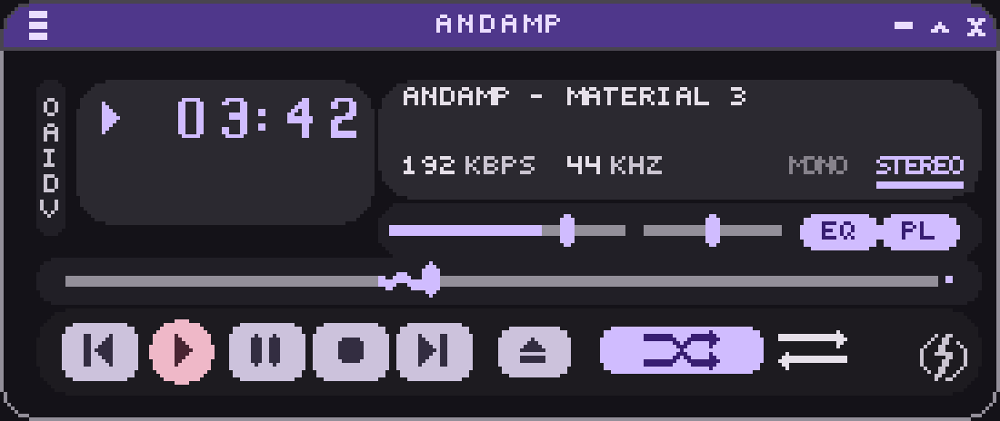
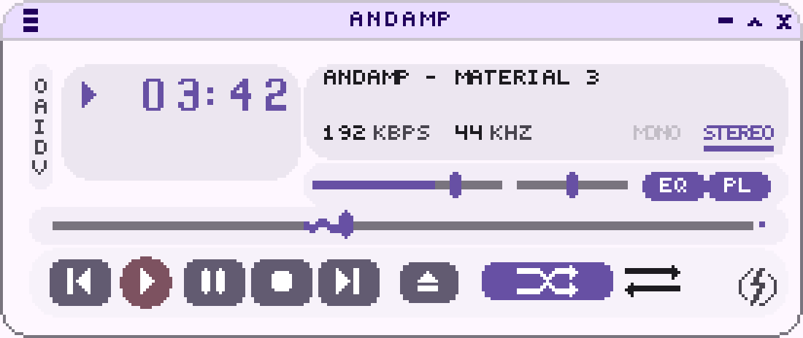
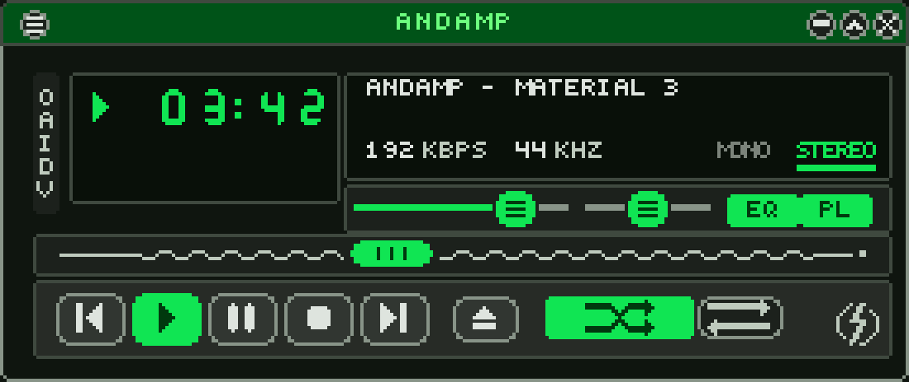

# AndAmp skins

Three classic Winamp 2.x skins (`.wsz`), generated from one source by a Python
script with no third-party dependencies: AndAmp Dark and Light, drawn in
Material 3 Expressive's style, and AndAmp Spot, in Winamp's own green and
amber. They are the skins Andamp ships, and every asset is reproducible byte
for byte.

| theme | file | look |
|---|---|---|
| `dark` (default) | `dist/AndAmp Dark.wsz` | Material 3 baseline purple with M3 Expressive's shapes: filled controls with no strokes, three shape families, a play button in another hue |
| `light` | `dist/AndAmp Light.wsz` | The same design in M3's baseline light scheme: dark controls on a near-white plate |
| `spot` | `dist/AndAmp Spot.wsz` | Winamp's LCD green and spectrum amber, outlined controls, seven-segment time display, grip-pill sliders |





The images above are written by the build (`preview`, `verify` and `all`):
`andamp/compose.py` blits every sprite onto the plate at its `main-window.css`
destination in one fixed playback state, so they are reproducible byte for
byte like the skins.

```bash
python3 build.py all        # verify + template for every theme
python3 build.py            # build the active theme
python3 build.py verify     # build + previews + verify the active theme
python3 build.py check      # rebuild and compare with dist/CHECKSUMS-<theme>.txt
python3 build.py preview    # build, and write dist/preview/<theme>/*.png
                            # and dist/preview/<theme>-window.png
python3 build.py template   # write the runtime template and check that it rebinds
```

The theme is chosen by `ANDAMP_THEME` (`dark` by default, or `light`/`spot`).
It is resolved once, at import, so `all` runs each theme in its own process.

Each `.wsz` holds the twenty BMP sheets, `PLEDIT.TXT`, `VISCOLOR.TXT`,
`REGION.TXT`, and a `readme.txt` with the skin's name, author and license,
which the Winamp Skin Museum shows as a skin's description.

`build.py template` (part of `all`) also writes
`dist/andamp-<theme>-template.zip` and `dist/andamp-<theme>-roles.json`: the
skin with its colors factored out, from which Andamp rebuilds AndAmp Dark and
Light from the phone's wallpaper palette. See
[docs/runtime-theming.md](docs/runtime-theming.md).

Install by dropping a `.wsz` into Winamp's `Skins` folder, or load it in
[Webamp](https://webamp.org) via *Options → Skins → Load skin*.

## Why the skins are generated

Winamp scales its windows by integer nearest-neighbor, so a blurred pixel
stays blurred at every zoom level. The drawing layer here cannot anti-alias:
`andamp/canvas.py` has no primitive that blends, eases or resamples, and every
write is checked against a registry of declared color tokens. An undeclared
color raises at draw time, and the verifier re-checks every emitted pixel
against the same registry.

## AndAmp Dark and Light

The `dark` palette is the Material 3 baseline dark scheme (seed `#6750A4`)
from Google's generated token export, and `light` is the baseline light
scheme. The values are copied literally.

What the two themes draw at 275x116:

- **A filled circular play button, larger than its neighbors.** It fills its
  whole cell and stands a pixel proud of the squircles either side, which keep
  the group's 1px gutter.
- **Connected button groups.** EQ/PL and the equalizer's ON/AUTO are touching
  pairs, so each pair is drawn as one segmented control: full radius on the
  group's outside, a 1px corner where a segment meets its neighbor.
  `shapes.cut_offsets` takes a per-corner radius map for this.
- **A wavy position bar with a stop indicator.** The played portion is the M3
  Expressive squiggle at amplitude 1px and wavelength 8px, and the track ends
  in the stop-indicator dot, drawn in the active color. Volume, balance and
  the EQ bands stay straight: the wave is a progress-indicator treatment in
  M3, and `Slider` has a plain track.
- **Narrow M3 slider handles** in place of Winamp grip pills. The position
  bar's handle sprite carries the transition: wavy active track to its left,
  inactive rail to its right.
- **Bare app-bar icons, on every window.** Window buttons are bare glyphs at
  rest with a filled circular state layer on hover and press, like a Material
  app bar. In the dark scheme no surface tone clears 3:1 against the
  `primary_container` title bar (the best is 2.07:1), so the state layer is a
  light one. Main, equalizer, equalizer-shade, playlist and plug-in windows
  all draw them through `win_button`. Shade collapses and takes an up
  chevron; expand restores and takes the down one.
- **Geometric numerals** in place of seven-segment ones. Two of their shapes
  are constrained: `NUMBERS.BMP` has no minus cell, so Webamp slices
  `MINUS_SIGN` out of the "2" at `(20, 6, 5, 1)` and `NO_MINUS_SIGN` out of the
  "1" at `(9, 6, 5, 1)`. Row 5 of the "2" must therefore be a solid run across
  columns 1–5, and row 5 of the "1" must be blank in columns 0–3.
- **Material Symbols weight.** Icons use 2px strokes with rounded terminals.
  Shuffle and repeat carry arrowheads: without them shuffle reads as an X
  ("close") and repeat as a bare ring ("record").
- **Tonal surface stacking.** The window plate is `surface`, the control
  trays `surface_container_low` and the display `surface_container_high`.
- **Arcs.** Corner radii of 4 and above are computed from a quarter arc, and
  `REGION.TXT` traces the same corner mask the canvas draws, so the window
  silhouette and the artwork agree. The title bars ask for that arc
  unclamped: a 14px strip is a slice of a 116px window, and a corner clamped
  to the strip's height would be a tighter arc inside the region's.
- **Andamp's mark in the corner.** The about target at `253,91,13x15` holds
  the brand's mark, a bolt through a broken ring, at the full 13px the box
  allows. It lives in `icons.py`, outside the two icon sets, because every
  theme draws the same one.
- **Round playlist corners.** Winamp's `REGION.TXT` has four sections (Normal,
  WindowShade, Equalizer, EqualizerWS) and none for the playlist. The build
  adds a `[Corners]` section holding the top-left corner cut, and Andamp
  mirrors it into all four corners of the playlist and the plug-in window at
  whatever size they are. In a player that does not read the section those
  windows stay rectangular, and the cut pixels show the sheet's window color.
- **The corner and the close button.** Winamp puts the close button 2px from
  the right edge of a 275px window, where the corner arc passes. The radius is
  11 and the four window-button glyphs are 5 wide, which leaves the X three
  clear columns and gives the 9x9 state disc a 2px ring around its glyph.
  `verify` asserts that no glyph is clipped. The tightest clearances are
  options 5, minimize 23, shade 14 and close 3 columns
  (`verify/audit.py` keeps them in `MARGINS`).

## Where M3 is adapted

Two M3 recipes are changed for a 12px sprite:

- **The selected-toggle indicator.** M3 nav bars fill it with
  `secondary_container`, which is 1.75:1 over the slider bed in `dark` and in
  `spot`. Selected takes a bright `primary` fill with dark content, M3's
  filled icon-toggle-button treatment, which is 9.6:1 over that bed.
- **The inactive slider track.** M3 puts it on `surface_container_highest`,
  1.33:1 over the bed in `dark` and `spot`. `outline` is M3's role for a 3:1
  boundary against a surface, so the slider rail uses that.

**The wavy track is drawn in the thumb.** A Winamp thumb is an opaque sprite,
29x10 for the position bar, so it must repaint the rail it covers. It lands at
an arbitrary pixel and cannot know a background wave's phase. The position
rail is therefore straight and the squiggle is part of the thumb sprite: wavy
behind the handle, flat ahead of it. The thumb's wave tapers in from flat at
its left edge.

**The channel indicator is a bar.** A filled chip does not fit: "stereo" is
24px of ink in a 29px cell. Color alone is weak: in the dark scheme `primary`
and M3's 38% disabled blend are 2.2:1 apart. State is shown by an indicator
bar under the lit label, the way a Material tab marks its selection.

Not asserted: display panel against window plate. M3 separates adjacent
surface containers by tone, and the panels are not interactive. `spot`, the
outlined theme, gives them a `hairline` frame.

## The filled treatment

`dark` and `light` share this treatment; `spot` uses the outlined one.

- **Fills in place of strokes.** Every card frame and button outline is
  dropped and tone carries the boundary. M3's container tones sit too close to
  their surface for that (`primary_container` on `surface` is 1.23:1 in the
  light scheme; a control boundary needs 3:1), so the fills are roles that
  clear 3:1 over the tray: `secondary` for the transport keys, `primary` for a
  selected toggle.
- **Three shape families.** A pill for chips, a squircle for the transport
  keys, a circle for the play button. At 1px resolution a superellipse
  quantizes to the pixels of a rounded rectangle, so the family is a corner
  radius: `h/2` for a pill, about `h/3` for a squircle.
- **The play button in another hue.** Every fill bright enough to clear 3:1
  over the tray has about the same luminance, so tone cannot set the play
  button apart. It is the only button filled with `tertiary`, and the only
  circle.
- **No container until a toggle is on.** Two bright fills cannot be 3:1 apart,
  and a dark unselected fill is not 3:1 over the bed. The unselected toggle is
  a bare glyph and the container appears when it is selected, like M3's icon
  toggle button.
- **Heavier strokes and larger radii.** Progress and slider tracks are 3px
  where `spot`'s are 2px, and containers take a radius of 11, so the shorter
  beds clamp to pills.
- **In light, the fills are dark.** The fills that clear 3:1 over a light tray
  are the dark ones: dark squircles on a near-white plate.

## Contrast is enforced

Every foreground/background pair in `PAIRS` in `andamp/palette.py` is asserted
at WCAG 4.5:1 for text and 3:1 for non-text. The build fails otherwise.

| pair | dark | light | spot | required |
|---|---|---|---|---|
| marquee text | 11.08:1 | 13.94:1 | 14.92:1 | 4.5:1 |
| time digits | 8.42:1 | 5.26:1 | 11.34:1 | 4.5:1 |
| kbps / khz | 8.42:1 | 7.63:1 | 11.35:1 | 4.5:1 |
| titlebar text active | 7.23:1 | 13.32:1 | 7.22:1 | 4.5:1 |
| titlebar text idle | 10.02:1 | 8.47:1 | 8.48:1 | 4.5:1 |
| titlebar glyph active | 7.23:1 | 13.32:1 | 7.22:1 | 3.0:1 |
| transport icon | 7.74:1 | 6.45:1 | 9.55:1 | 3.0:1 |
| transport icon pressed | 7.71:1 | 6.44:1 | 7.76:1 | 3.0:1 |
| play emphasis fill | 10.05:1 | 5.86:1 | 8.46:1 | 3.0:1 |
| play emphasis icon | 7.75:1 | 6.47:1 | 7.76:1 | 3.0:1 |
| toggle on glyph | 7.71:1 | 6.44:1 | 7.76:1 | 3.0:1 |
| posbar track | 5.14:1 | 3.96:1 | 5.17:1 | 3.0:1 |
| posbar thumb | 9.56:1 | 5.60:1 | 9.62:1 | 3.0:1 |
| slider active track | 9.56:1 | 5.60:1 | 9.62:1 | 3.0:1 |
| slider inactive track | 5.14:1 | 3.96:1 | 5.17:1 | 3.0:1 |
| slider handle | 9.56:1 | 5.60:1 | 9.62:1 | 3.0:1 |
| slider level | 9.59:1 | 5.62:1 | 9.60:1 | 3.0:1 |
| window button hover | 13.24:1 | 15.57:1 | 11.13:1 | 3.0:1 |
| window button glyph | 13.32:1 | 17.17:1 | 13.31:1 | 3.0:1 |
| mono/stereo label | 8.42:1 | 5.26:1 | 11.34:1 | 3.0:1 |
| mono/stereo indicator | 8.42:1 | 5.26:1 | 11.34:1 | 3.0:1 |
| eq band thumb | 9.56:1 | 5.60:1 | 9.62:1 | 3.0:1 |
| eq graph line | 11.33:1 | 4.97:1 | 11.34:1 | 3.0:1 |
| playlist normal text | 14.90:1 | 17.07:1 | 14.92:1 | 4.5:1 |
| playlist current text | 14.98:1 | 17.17:1 | 14.91:1 | 4.5:1 |
| playlist text on sel | 4.81:1 | 5.03:1 | 4.83:1 | 4.5:1 |
| playlist current on sel | 4.83:1 | 5.06:1 | 4.83:1 | 4.5:1 |
| playlist selection band | 3.10:1 | 3.39:1 | 3.09:1 | 3.0:1 |
| visualiser peak | 11.08:1 | 13.94:1 | 14.92:1 | 3.0:1 |
| transport fill | 10.02:1 | 5.85:1 | — | 3.0:1 |
| toggle off glyph/tray | 13.17:1 | 15.48:1 | — | 3.0:1 |
| toggle off glyph/bed | 12.57:1 | 14.85:1 | — | 3.0:1 |
| toggle on fill/tray | 10.02:1 | 5.84:1 | — | 3.0:1 |
| toggle on fill/bed | 9.56:1 | 5.60:1 | — | 3.0:1 |
| transport outline | — | — | 4.55:1 | 3.0:1 |
| toggle off glyph | — | — | 9.64:1 | 3.0:1 |
| toggle off outline | — | — | 5.85:1 | 3.0:1 |
| toggle off outline/tray | — | — | 4.55:1 | 3.0:1 |
| toggle on vs off fill | — | — | 9.62:1 | 3.0:1 |

## Tokens

| role | dark | light | spot |
|---|---|---|---|
| `primary` | `#D0BCFF` | `#6750A4` | `#10E553` |
| `on_primary` | `#381E72` | `#FFFFFF` | `#00390E` |
| `primary_container` | `#4F378B` | `#EADDFF` | `#005318` |
| `on_primary_container` | `#EADDFF` | `#21005D` | `#6CFF7E` |
| `secondary_container` | `#4A4458` | `#E8DEF8` | `#374C37` |
| `tertiary` | `#EFB8C8` | `#7D5260` | `#FFB86D` |
| `surface` | `#141218` | `#FEF7FF` | `#0F150F` |
| `surface_container_low` | `#1D1B20` | `#F7F2FA` | `#181D18` |
| `surface_container` | `#211F26` | `#F3EDF7` | `#1C211C` |
| `surface_container_high` | `#2B2930` | `#ECE6F0` | `#272B26` |
| `surface_container_highest` | `#36343B` | `#E6E0E9` | `#313631` |
| `on_surface` | `#E6E0E9` | `#1D1B20` | `#DEE4DE` |
| `on_surface_variant` | `#CAC4D0` | `#49454F` | `#BECABD` |
| `outline` | `#938F99` | `#79747E` | `#889488` |
| `outline_variant` | `#49454F` | `#CAC4D0` | `#3F493F` |
| `selection` | `#655D74` | `#8F889F` | `#516650` |
| `current_track` | `#EADDFF` | `#21005D` | `#6CFF7E` |

A theme is `andamp/tokens/<name>.py`. It defines `SCHEME` (`"dark"` or
`"light"`), `SKIN` (the `.wsz` file name), `WORDMARK`, a `ROLES` table of
literal hex (`dark`, `light`) or a `TONES` table of seed-and-tone pairs
(`spot`), a `DERIVED` table with the `selection` tone, and a `STYLE` table
choosing digits, iconography, slider treatment and the shape scale. A new
theme's name also goes in `NAMES` in `andamp/tokens/__init__.py`, and its
readme line in `BLURBS` in `andamp/textfiles.py`. `verify` fails when a
palette breaks a contrast requirement.

`dark` and `light` have the same `STYLE`: they are one design in two schemes
and differ only in color. Most aliases in `palette.py` are written in terms of
M3 roles and need no branch, because the role table flips with the scheme.
Four read the scheme: `vis_floor` (a recess is the lowest container tone in a
dark scheme and the highest in a light one), and `current_track`,
`win_hover_fill` and `win_hover_ink`, which take the role that stays readable
in each scheme.

## What the verifier checks

Over a thousand assertions per theme, all of which must pass for `verify` to
succeed:

1. Every sheet matches its spec dimensions.
2. Every pixel of every BMP is a declared token.
3. Every painted color is a role. `andamp/roles.py`'s table, resolved, equals
   `palette.py` entry for entry, and nothing is painted that the table does
   not name. This is what lets the runtime template rebind every pixel.
4. Every sprite rectangle lies inside its sheet.
5. Every declared contrast pair clears its WCAG threshold.
6. No pressed or selected sprite is pixel-identical to its normal state.
7. No named sprite is a flat rectangle.
8. `PLEDIT.TXT` has all five keys with 7-character colors; `VISCOLOR.TXT` has
   24 parseable lines; `REGION.TXT` has Winamp's four sections and point
   counts matching `NumPoints`.
9. Every BMP is 24-bit, uncompressed, bottom-up, with a 40-byte header.
10. The archive holds only uppercase `.BMP`/`.TXT` at its root (plus
    `readme.txt`, which is not part of the format), no folders, no
    case-insensitive collisions, and every sheet and text file classic Winamp
    requires.
11. **Layout grid** (`verify/audit.py`): every container edge on the main
    window lands on a declared rail, and the equalizer card's two slider
    columns are inset equally.
12. **Geometry** (`verify/audit.py`): no icon is larger than the box it is
    stamped into, no mask's ink is lopsided inside its own grid, no control
    or glyph has opposite margins that differ by more than a pixel, every
    listed sprite's bed is the color it lands on, and no window-button glyph
    is clipped by the window's corner. Structural pieces (stretch tiles,
    stacked frame strips, the minus sign that aligns to the digits' mid-bar,
    the channel label that must not move between states) are listed in
    `EXPECTED` as allowed asymmetries.

Content is centered on measured ink. A text glyph's 5px cell carries a 1px
gutter that is not ink, so centering on `len * 5` would put every label half a
pixel left.

Webamp falls back to its own defaults for `PLEDIT.TXT`, `VISCOLOR.TXT` and
`REGION.TXT` without an error, so a browser screenshot does not show that one
is missing or malformed. Check 8 does.

## Live testing

```bash
npm install && python3 -m http.server 8000
# http://localhost:8000/verify/index.html
#   ?skin=AndAmp%20Spot     load another skin
#   ?x2=1                   double size
```

`verify/index.html` mounts Webamp with all three windows open and four silent
`data:` tracks. `?skin=` names a file in `dist/` without its `.wsz`. The
instance is exposed as `window.__webamp`, and the three skins are listed in
the right-click *Skins* menu.

## Layout

```
build.py              entry point (build / preview / verify / check / template / all)
andamp/
  bmp.py  png.py      encoders (stdlib struct / zlib)
  canvas.py           integer pixel ops; cannot anti-alias
  tonal.py            CIELAB tone ramps, WCAG contrast
  tokens/             one module per theme: ROLES or TONES, DERIVED, STYLE,
                      SCHEME, SKIN
  palette.py          resolved role table + declared contrast pairs
  roles.py            where each palette value comes from, machine-readable
  template.py         the build with its colors factored out
  glyphs.py           5x6 face, seven-segment and geometric digits, GEN caps
  icons.py            1px set (spot), and the brand mark
  icons_symbols.py    2px Material Symbols set (dark, light)
  art.py              re-exports the active theme's icons
  compose.py          composites the main window for the preview
  shapes.py  draw.py
  sheets/             one module per BMP
  textfiles.py        PLEDIT / VISCOLOR / REGION / readme
  package.py          deterministic zip
spec/sprites.py       sheet sizes and sprite rectangles
verify/               static invariants, geometry audit, contrast sweep,
                      Webamp harness
docs/                 runtime-theming.md: the runtime template
```

## Resting sprites differ between players

Webamp draws the equalizer's close button from the title bar art and uses
`EQ_CLOSE_BUTTON` at (0, 116) only on `.clicked`. Classic Winamp, and players
that follow it such as Andamp, treat (0, 116) as the button's resting sprite
and draw it all the time.

So it is built as the resting face: the same glyph on the same
`primary_container` ground as the face painted into the selected title bar.
One opaque 9x9 sprite cannot match two title-bar colors, so on an unfocused
equalizer it shows as a colored chip.

The same applies to `SHADE_CLOSE_BUTTON` in `EQ_EX.BMP`. The sprites named
`*_ACTIVE` are pressed states and are built as such.

## The playlist shade bar tiles

`PLAYLIST_SHADE_BACKGROUND` is the bar's repeating fill, although it sits next
to `_LEFT` in the sprite table. Webamp sets it on the container with no
`background-repeat`, and puts `_LEFT` and `_RIGHT` on no-repeat children, so
anything drawn into it repeats across the whole bar.

Only the right cap has a focused variant, so the tile and left cap carry one
color for both states. The right cap's two variants differ in content color.

The equalizer's shade-mode sliders have no track sprite either. The format
supplies only the 3x7 handle pieces, so their rails are painted into the shade
background.

## Known limits

- **Not tested in Winamp itself.** Verification uses Webamp. Compatibility
  with Winamp rests on format rules (24-bit BMP only, no PNG; uppercase names;
  no folder in the archive), which checks 9 and 10 enforce.
- `VIDEO.BMP`, `AVS.BMP` and `MB.BMP` are drawn as plain tonal frames. Their
  sprite rectangles are not in the Webamp table, so they are not mapped sprite
  by sprite.
- `GENEX.BMP`'s pressed button sprite overlaps its unpressed one by one row
  upstream, so those two states differ by a 1px shift.
- On an unfocused equalizer the close button shows as a colored chip, because
  its resting sprite can only carry one title-bar color. See above.
